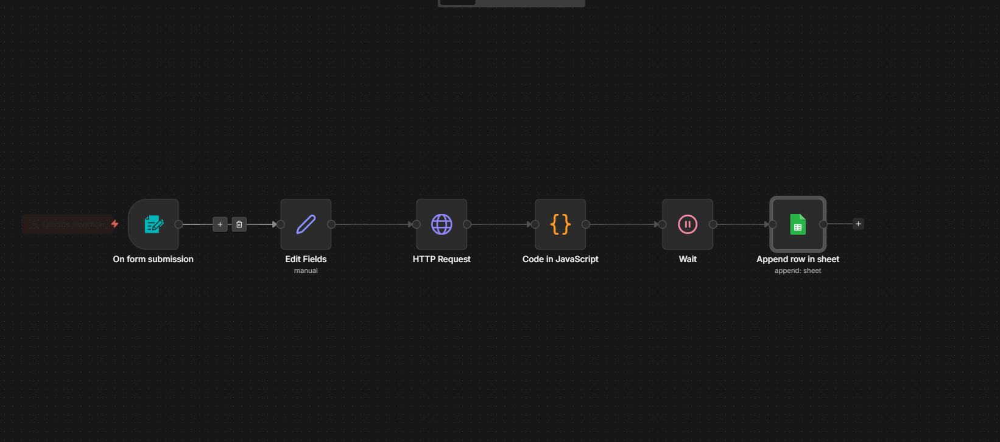
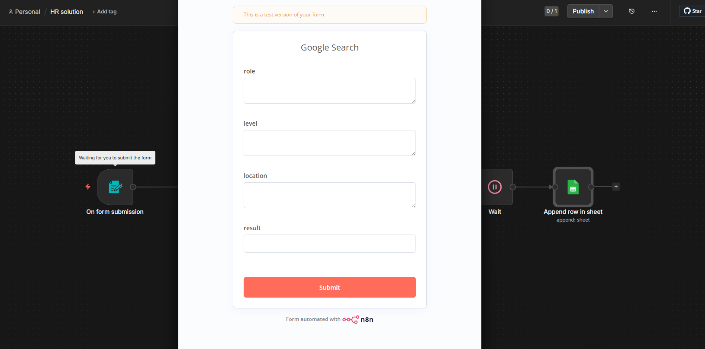

# HR Solution – Candidate Scraper Automation (n8n)

An automated workflow built with **n8n** that helps HR teams easily find candidates online (LinkedIn) and automatically store them in a structured Google Sheet.


## Overview

This project automates the process of:
- Searching candidates on LinkedIn (via Google search)
- Extracting structured results using SerpApi
- Cleaning and formatting the data with JavaScript
- Storing results directly into Google Sheets

It saves time for recruiters by reducing manual searching and copy-paste work.

---

## Workflow Preview

### n8n Workflow


---

## How it works

### 1. Form Trigger (Input Step)
After running the workflow, the HR receives a form:



You can enter:

- **Role** → job title (e.g. Frontend Developer)
- **Level** → optional (Junior / Mid / Senior)
- **Location** → optional (e.g. Morocco, USA....)
- **Result** → number of candidates to fetch per search

---

### 2. Search Process

The system builds a query like : 
<i><b>linkedin.com/in "role" "level" "location"</b></i>

Then it sends a request to **SerpApi** to fetch Google results.

> Note: Google search API limitations pushed this project to use SerpApi instead.

---

### 3. Data Cleaning (JavaScript)

The raw API response is cleaned using a Code node in n8n:

```js
const items = $input.all();

const results = [];

for (const item of items) {
  const organic = item.json.organic_results || [];

  for (const result of organic) {
    results.push({
      title: result.title || null,
      link: result.link || null,
      description: result.snippet || null,
      displayed_link: result.displayed_link || null,

      snippet_highlighted_words: result.snippet_highlighted_words || [],

      // safe nested extraction
      languages: result.about_this_result?.languages || [],
      regions: result.about_this_result?.regions || []
    });
  }
}

return results.map(r => ({ json: r }));